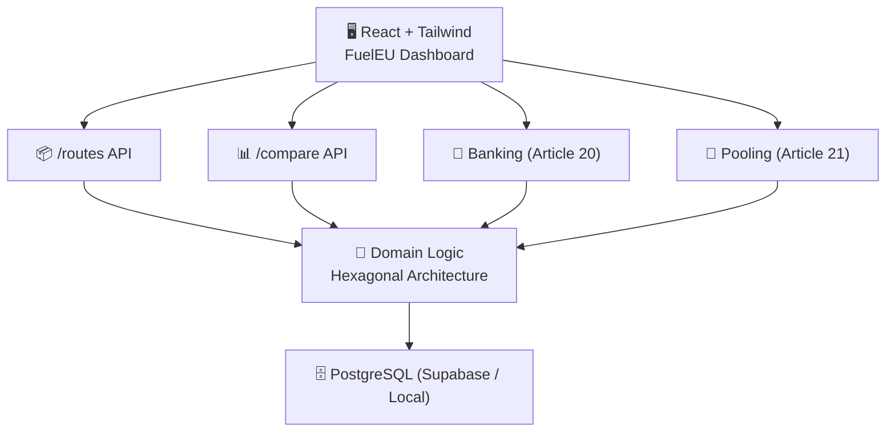

# 🌊 FuelEU Maritime Compliance Platform  
Hexagonal Architecture • Full-Stack (React + Node + PostgreSQL + Prisma + TypeScript)

This project implements a **FuelEU Maritime Compliance Platform**, based on the FuelEU regulation (EU 2023/1805).  
It calculates vessel emission compliance, enables *Banking* (Article 20) and *Pooling* (Article 21), and provides an interactive dashboard.

---

## 🚀 Tech Stack

| Layer | Technology |
|--------|-----------|
| Frontend | React + TypeScript + Vite + TailwindCSS |
| Backend | Node.js + Express + Prisma ORM |
| Database | PostgreSQL (supports Supabase / Render / Local DB) |
| Architecture | Hexagonal (Ports & Adapters / Clean Architecture) |

---

## 📂 Project Structure (Monorepo)
```
/FuelEU-Maritime
│
├── backend/ # Node.js + Prisma + Clean Architecture
│ ├── src/
│ │ ├── core/ # Domain + Application logic (business logic)
│ │ ├── adapters/ # Controllers (HTTP), DB adapters (Prisma)
│ │ └── infrastructure # Server + Prisma client
│ ├── prisma/ # Migrations + schema
│ ├── .env # NOT committed (database credentials)
│ └── package.json
│
└── frontend/ # React + Vite + Tailwind
├── src/
│ ├── components/
│ ├── assets/
│ └── App.tsx
├── index.html
└── package.json
```
## ⚡ System Architecture — FuelEU Maritime Platform



---

## 🔧 Setup Instructions (Local Development)

### ✅ 1. Clone Repository

```sh
git clone https://github.com/okroshan4u/FuelEU-Maritime/
cd FuelEU-Maritime
```

## ✅ 2. Backend Setup
``
cd backend
npm install
``

### Create a ``.env`` file inside ``/backend``:
```
DATABASE_URL="postgresql://<user>:<password>@<host>:5432/postgres?sslmode=require"
DIRECT_URL="postgresql://<user>:<password>@<host>:5432/postgres"
```

### Generate Prisma client:
```
npx prisma generate
```

### Run backend:
```
npm run dev
```

### Backend should now be running at:

👉``` http://localhost:4000```

## ✅ 3. Frontend Setup
```
cd frontend
npm install
npm run dev
```

### Frontend will run at:

👉``` http://localhost:5173```

### ✅ API Endpoints
### Routes API

| Method | Endpoint                 | Description                |
| ------ | ------------------------ | -------------------------- |
| GET    | `/api/routes`            | Fetch all maritime routes  |
| POST   | `/api/baseline/:routeId` | Set baseline route         |
| GET    | `/api/compare`           | Compare baseline vs others |


### Banking API (Article 20)
| Method | Endpoint            | Description                         |
| ------ | ------------------- | ----------------------------------- |
| GET    | `/api/bank/cb`      | Get current compliance balance (CB) |
| POST   | `/api/bank/apply`   | Bank positive CB                    |
| POST   | `/api/bank/surplus` | Apply banked surplus                |


### Pooling API (Article 21)
| Method | Endpoint            | Description                              |
| ------ | ------------------- | ---------------------------------------- |
| GET    | `/api/pool/members` | Get adjusted CB for pool members         |
| POST   | `/api/pool/create`  | Create pool (surplus distribution logic) |


## ✨ Features

✅ Hexagonal Architecture (domain decoupled from framework)
✅ Frontend fetches live data from backend APIs
✅ Banking logic (positive CB → bank storage)
✅ Pooling logic (surplus ships offset deficit ships)
✅ Error handling + validation
✅ Toast notifications for user feedback


## 📸 Screenshots


# 🧠 Project Documentation

---

## 🔍 Agent Workflow Logs

**Documented in:** `AGENT_WORKFLOW.md`

**Includes:**
- prompts used  
- refactoring experiments  
- validation/corrections  

---

## 📘 Reflection

**Written in:** `REFLECTION.md`

**Covers:**
- learnings from using AI agents (Copilot, ChatGPT, Cursor, etc.)  
- efficiency gains  
- future improvements  

---

## 🧪 Testing (Optional)

Run backend unit tests (if added):

```sh
npm run test
```

## ✉️ Contact

Built by Roshan Kumar Ram <br/>
📧 okroshan4u@gmail.com 

💼 GitHub: https://github.com/okroshan4u


## 🌟 Feel free to ⭐️ star the repo if this helped!
